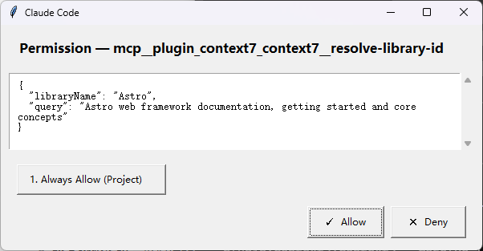
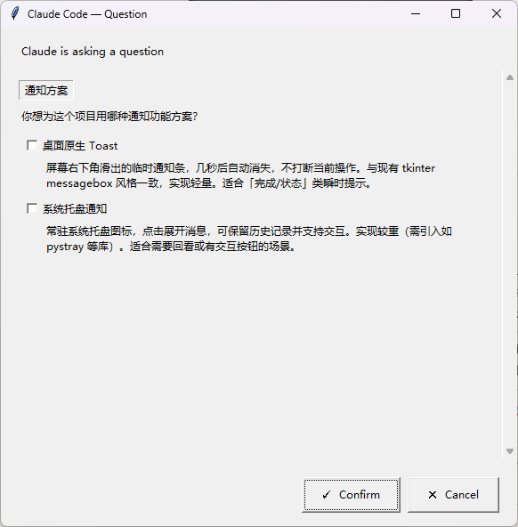
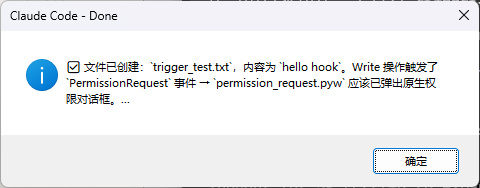
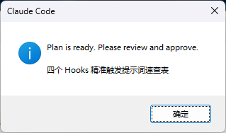

# Claude Code Hooks for Windows

Replace Claude Code's terminal permission prompts with native Windows GUI dialogs — zero dependencies, just Python + tkinter.

## Demo

| Hook | Screenshot |
|------|------------|
| Permission Request |  |
| Ask User Question |  |
| Stop Notify |  |
| Exit Plan Mode |  |

## Features

| Hook | Event | What it does |
|------|-------|--------------|
| **Permission Request** | `PermissionRequest` | Allow/Deny dialog with suggestion buttons (session/project/global scope) |
| **Ask User Question** | `PreToolUse` → `AskUserQuestion` | Native option dialog — single select or multi select, with free-text "Other" input |
| **Stop Notify** | `Stop` | Auto-closing messagebox when Claude finishes (8s) |
| **Exit Plan Mode** | `PermissionRequest` → `ExitPlanMode` | Topmost messagebox when plan is ready (auto-closes 25s) |

- **Zero dependencies** — Python 3.10+ + tkinter, nothing else
- **Keyboard shortcuts** — Enter to Allow, Escape to Deny, number keys for suggestions
- **`.pyw` suffix** — no console window flash

## Install

### One-click (share URL with AI)

Share this URL with your Claude Code:

```
https://raw.githubusercontent.com/BaixuanZhu/claude-code-hooks/main/skills/SKILL.md
```

The AI reads `SKILL.md` and installs everything automatically — no manual steps.

> If `raw.githubusercontent.com` is unreachable, use `git clone` as fallback (see SKILL.md for details).

### Human install (PowerShell one-liner)

```powershell
iwr https://raw.githubusercontent.com/BaixuanZhu/claude-code-hooks/main/install.ps1 -UseBasicParsing | iex
```

Downloads all 4 hooks and merges into `~/.claude/settings.json`. Idempotent — safe to re-run.

### Manual

1. Clone the repo
2. Copy `hooks/*.pyw` into `~/.claude/hooks/scripts/` (create the folder if needed)
3. Add to `~/.claude/settings.json`:

```json
{
  "hooks": {
    "PermissionRequest": [
      {
        "matcher": "Bash|Edit|Write|Read|Glob|Grep|WebFetch|WebSearch|mcp__.*",
        "hooks": [{ "type": "command", "command": "pythonw ~/.claude/hooks/scripts/permission_request.pyw" }]
      },
      {
        "matcher": "ExitPlanMode",
        "hooks": [{ "type": "command", "command": "pythonw ~/.claude/hooks/scripts/exit_plan_mode_notify.pyw" }]
      }
    ],
    "PreToolUse": [
      {
        "matcher": "AskUserQuestion",
        "hooks": [{ "type": "command", "command": "pythonw ~/.claude/hooks/scripts/ask_user_question.pyw" }]
      }
    ],
    "Stop": [
      {
        "hooks": [{ "type": "command", "command": "pythonw ~/.claude/hooks/scripts/stop_notify.pyw" }]
      }
    ]
  }
}
```

4. Restart Claude Code

> Use `pythonw` (not `python`) — prevents console window flash. `~` is expanded automatically by Claude Code.

## Limitations

- **Windows only** — tkinter dialogs are Windows-native
- **No dark mode** — uses system default styling
- **Stop notify requires modern terminal** — Windows Terminal / WezTerm; legacy `cmd.exe` doesn't support some escape sequences (we use messagebox, not OSC 9, so this is not a hard requirement)

## License

[MIT](LICENSE)
